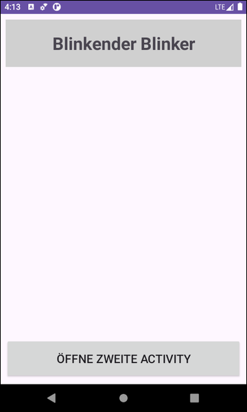
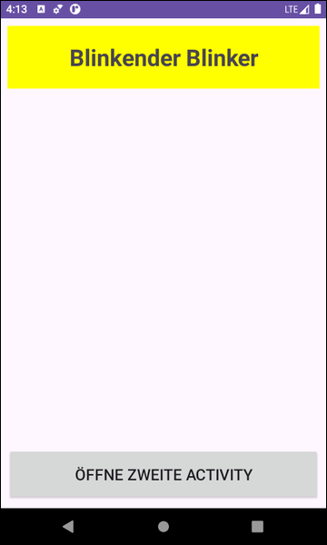

# Android-App "Blinker-Pause" #

 

Android-App mit Java, deren Quellcode als Übungsaufgabe zu modifizieren ist:
das blinkende Element auf der `MainActivity` soll aufhören zu blinken, wenn diese Activity
durch die anderen Activity in der app überdeckt wird (das Blinken ist ja dann nicht mehr
sichtbar, so dass die Blinker-Schleife CPU-Zeit verschwendet).

 

----

## Screenshots ##

 

 &nbsp; 

 

----

## License ##

 

See the [LICENSE file](LICENSE.md) for license rights and limitations (BSD 3-Clause License).

 
